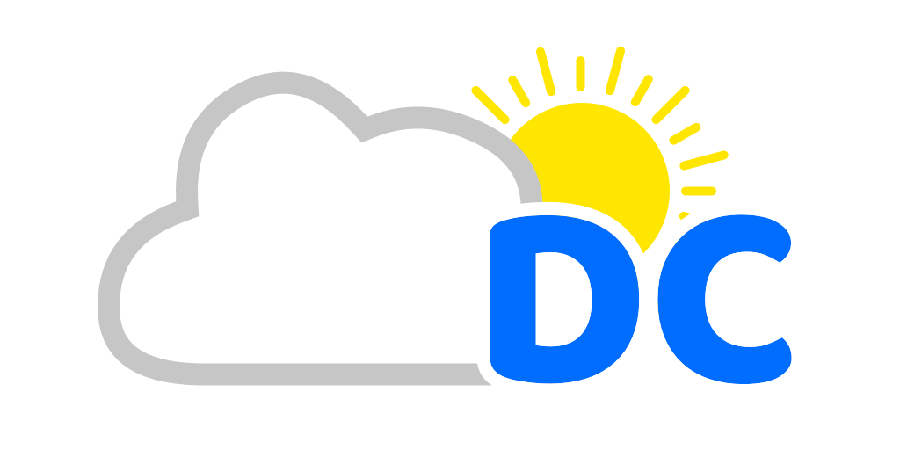

# libDCWeather

A weather fetching library for jailbroken iOS devices



[](https://github.com/dtcalabro/libDCWeather/stargazers)
[](https://github.com/dtcalabro/libDCWeather/network/members)
[](https://github.com/dtcalabro/libDCWeather/issues)
[](LICENSE)

## Overview

- Fetches weather using `Weather.framework`
- Simple and easy to use
- Options to fit your needs

## Weather Data

- [X] Current condition string (48 conditions not including severe weather alerts)
- [X] Current condition image (supports day and night images)
- [X] Current temperature (supports Celsius and Fahrenheit, but defaults to the user's prefered unit)
- [X] Current city name
- [ ] Daily high and low temperatures
- [ ] Feels like temperature
- [ ] Humidity
- [ ] Wind speed and direction
- [ ] Visibility

## Features

- [X] Listen for weather update notifications
- [X] Fetch weather data on demand
- [X] Set the weather auto update interval (default is 5 minutes)
- [X] Set the distance threshold to consider the location as changed (default is 1 mile)
- [X] Choose whether to support severe weather alerts, which applies to both condition strings and images (default is NO)
- [ ] Multilingual support

## I am a user, where can I get this?

I should preface that this library does not do anything on its own. It is meant to be used by developers in their projects.

With that being said, if you still wish to install this library, it can be downloaded from my repository at <https://dtcalabro.github.io/repo>.

## I am a developer, how do I integrate this into my project?

If you wish to integrate this library into your project, you can follow the instructions below.

## Installation

Run the following command to install the library to your Theos environment

```bash
./install_to_theos.sh
```

## Project Integration

You will need to add it to the libraries in your project makefile

```makefile
TWEAKNAME_LIBRARIES = dcweather
```

You must also add it to your project's control file like so

```control
Depends: mobilesubstrate, com.dcproducts.libdcweather
```

Then you can import the library in your tweak and start using it

```objc
#import <libDCWeather.h>
```

## Usage

There are two ways to initialize the library. You can either use the shared instance or create a new instance depending on your needs.

```objc
// Shared instance
DCWeather *weather = [DCWeather sharedInstance];
```

```objc
// New instance
DCWeather *weather = [[DCWeather alloc] init];
```

### Setting the auto update interval

There are three ways to set the auto update interval. The default is 5 minutes but you can either set it to a specific number of seconds, minutes or hours.

```objc
// Seconds
[weather setAutoUpdateInvervalInSeconds:30];

// Minutes
[weather setAutoUpdateInvervalInMinutes:5];

// Hours
[weather setAutoUpdateInvervalInHours:1];
```

### Setting the distance threshold

You can set the distance threshold to consider the location as changed. The default is 1 mile but you can change it to your liking.

```objc
// Meters
[weather setDistanceThresholdToConsiderLocationChangeInMeters:100];

// Kilometers
[weather setDistanceThresholdToConsiderLocationChangeInKilometers:1];

// Feet
[weather setDistanceThresholdToConsiderLocationChangeInFeet:500];

// Yards
[weather setDistanceThresholdToConsiderLocationChangeInYards:250];

// Miles
[weather setDistanceThresholdToConsiderLocationChangeInMiles:2];
```

### Setting the severe weather alerts support

You can choose whether to support severe weather alerts. This applies to both condition strings and images. The default is NO but you can change it to YES if you wish to support severe weather alerts.

```objc
[weather conditionIncludesSevereWeather:YES];
```

### Forcing a weather update

Weather will automatically update based on the auto update interval you set. However, if you wish to force a weather update, you can do so at any point by calling the following method.

```objc
[weather requestRefresh];
```

### How to get current temperature

```objc
NSString *temperature = [weather temperatureString];
```

### How to get current condition string

```objc
NSString *condition = [weather conditionString];
```

### How to get current condition image

```objc
UIImage *conditionImage = [weather conditionImage];
```

### How to get current city name

```objc
NSString *city = [weather cityName];
```

### How to listen for updates

You can listen for updates by adding an observer to the default notification center. Currently, you can listen for the temperature, location, and condition changes.

```objc
// Assuming you wish to invoke the temperatureChanged method when the temperature changes
[[NSNotificationCenter defaultCenter] addObserver:self
                                      selector:@selector(temperatureChanged)
                                      name:@"kDCWeatherTemperatureChange"
                                      object:nil];

// Assuming you wish to invoke the locationChanged method when the location changes
[[NSNotificationCenter defaultCenter] addObserver:self
                                      selector:@selector(locationChanged)
                                      name:@"kDCWeatherLocationChange"
                                      object:nil];

// Assuming you wish to invoke the conditionChanged method when the condition changes
[[NSNotificationCenter defaultCenter] addObserver:self
                                      selector:@selector(conditionChanged)
                                      name:@"kDCWeatherConditionChange"
                                      object:nil];
```

## Donations

If you like the project and wish to support my work, please consider donating. Your support is greatly appreciated.

<a href="https://www.buymeacoffee.com/dtcalabro"></a>

## Credits

Developed and maintained by [dtcalabro](https://github.com/dtcalabro)

## License

- libDCWeather is available under the GPLv3 license. See the [LICENSE](LICENSE) file for more info.
- __Please don't steal my work!__ I spent a lot of time making this come to life, so if you wish to use this library in your project, please give credit where credit is due.

## Submit Bugs or Fixes

<https://github.com/dtcalabro/libDCWeather/issues>
